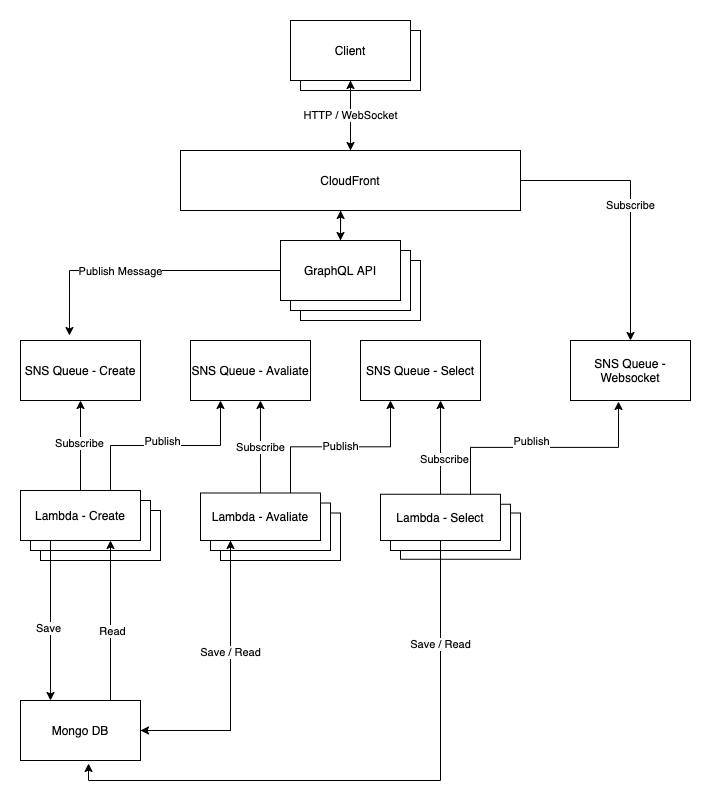

# No Code GA
*this project was made for the class Evolutionary Algorithms applied to Robotics (SSC0713) at ICMC/USP*

This is a platform to run genetic algorithms with *almost* no code skills required. You can define your algorithm parameters, we'll run everything automagically and present the results in our dashboard.

## Dependencies

- [NodeJS](https://nodejs.org/en/)
- [Yarn](https://yarnpkg.com/)
- [MongoDB](https://www.mongodb.com/)
- [DynamoDB](https://aws.amazon.com/pt/dynamodb/)
- [Serverless](https://www.serverless.com/)

## How to run

- Install dependencies: run `yarn`

### Server
- Create `.env` file (see `.env.example`);
- Run `yarn server:graphql` for local development

## Web
- Create `.env` file (see `.env.example`);
- Run `yarn web:start` for local development

## Architecture

- AWS Lambda Functions to run multiple algorithms and algorithm steps in parallel and distributed.
- MongoDB to persist data.
- NodeJS, React and GraphQL for the web application.

## Next Steps
- Database access can be a bottleneck, find ways to improve this part
- Improve platform to support more algorithm parameters (like multi-objective optimization)

## References
[Applications of Evolutionary Computation](https://books.google.com.br/books?id=jEDcDwAAQBAJ&pg=PA690&hl=pt-BR&source=gbs_selected_pages&cad=2#v=onepage&q&f=false)
